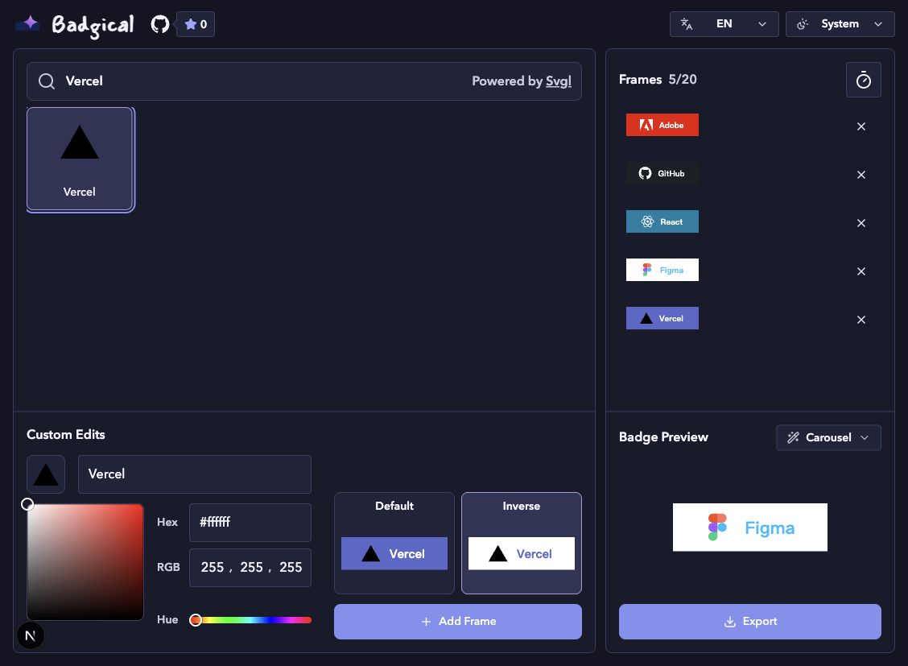

# Badgical

Badgical is a small web app for building animated SVG badges from [SVGL](https://svgl.app/) logos.

Use it to make README badges that rotate through products, tools, sponsors, or project stack items without hand-editing SVG.

<p align="center">
  
</p>

## What It Does

- Searches the SVGL logo catalog.
- Builds badge frames with editable text, colors, and SVG source.
- Supports slot and carousel animations.
- Exports a standalone animated SVG.
- Generates README Markdown with a useful alt description.
- Includes English and Traditional Chinese UI.

## Development

```bash
bun install
bun run dev
```

## Checks

```bash
bun run check
```

`bun run check` runs TypeScript, ESLint, Prettier, and a production Next.js build.

## Notes

Badgical is built with Next.js App Router and uses SVGL as the logo source.
